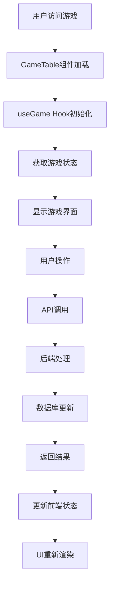
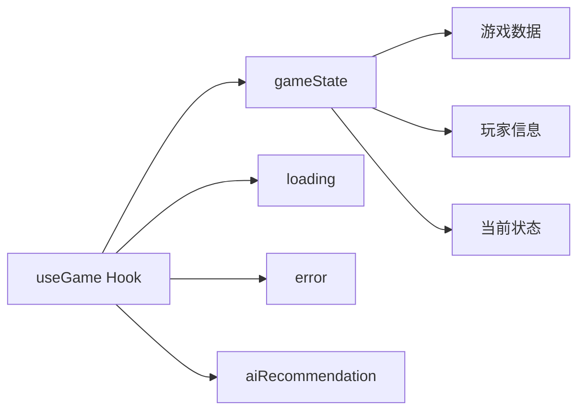
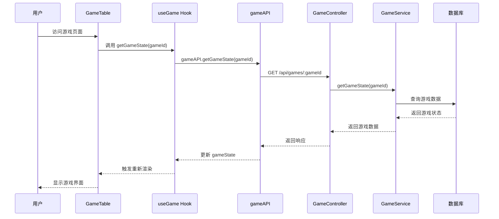
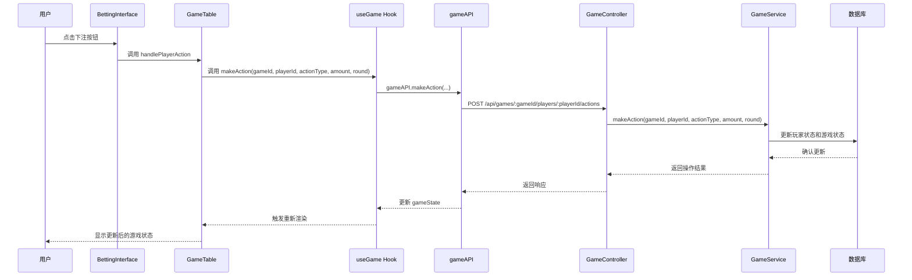
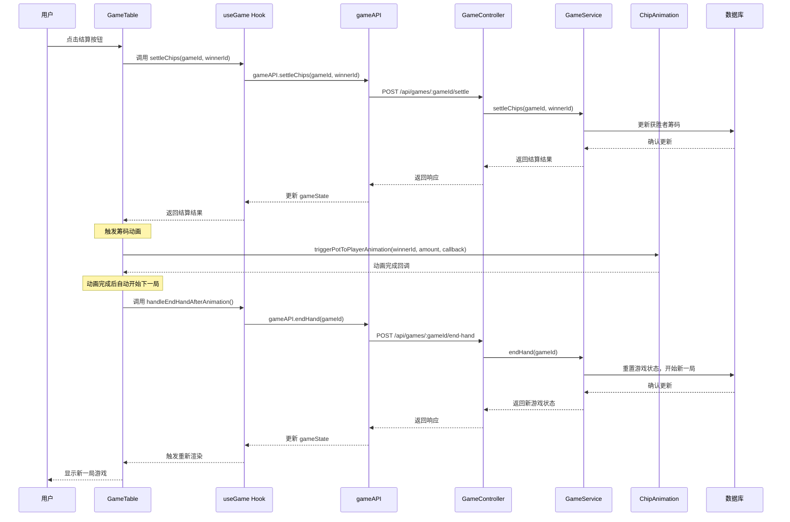
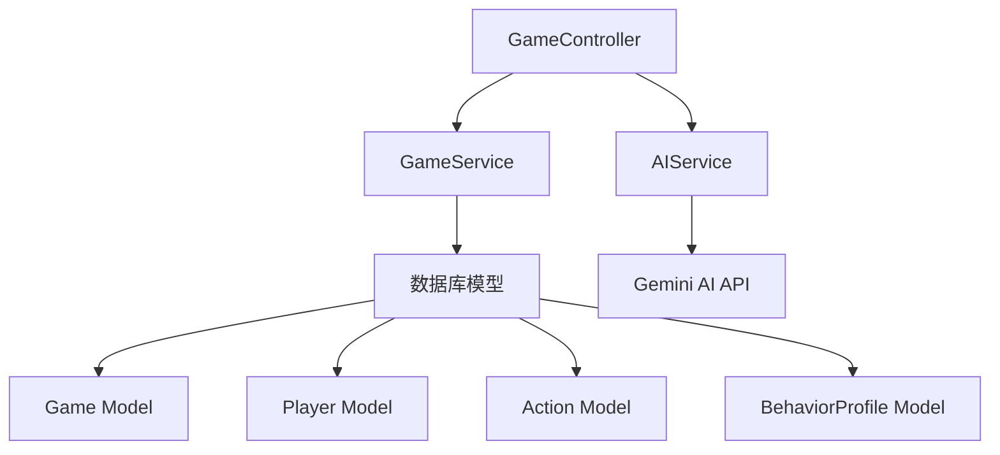
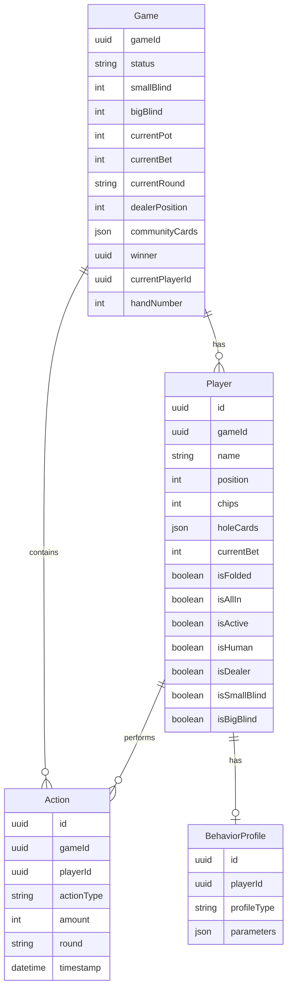
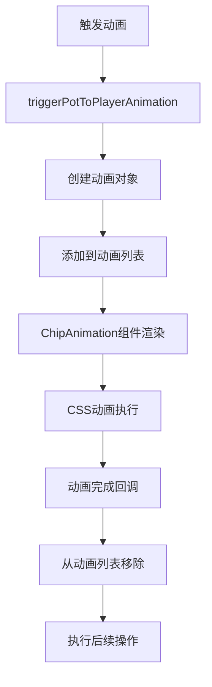

# 德州扑克游戏方法调用链路图

## 概述
本文档详细描述了德州扑克游戏中各个组件之间的方法调用关系，帮助开发者理解代码结构和排查问题。

## 1. 游戏流程概览



## 2. 前端组件架构

### 2.1 主要组件层次结构

```
App.js
├── GameSetup.js (游戏设置)
└── GameTable.js (主游戏界面)
    ├── PlayerSeat.js (玩家座位)
    ├── BettingInterface.js (下注界面)
    ├── CommunityCards.js (公共牌)
    ├── PotDisplay.js (底池显示)
    ├── ChipAnimation.js (筹码动画)
    ├── SettleChipsDialog.js (结算对话框)
    └── 其他UI组件...
```

### 2.2 状态管理 (useGame Hook)



## 3. 关键方法调用链路

### 3.1 游戏初始化流程



### 3.2 玩家下注流程



### 3.3 游戏结算流程 (修复后的版本)



## 4. 后端服务架构

### 4.1 服务层结构



### 4.2 数据库模型关系



## 5. API 端点映射

### 5.1 游戏管理端点

| 方法 | 端点 | 控制器方法 | 服务方法 | 描述 |
|------|------|------------|----------|------|
| POST | `/api/games` | createGame | createGame | 创建新游戏 |
| GET | `/api/games/:gameId` | getGameState | getGameState | 获取游戏状态 |
| POST | `/api/games/:gameId/players` | addPlayer | addPlayer | 添加玩家 |
| POST | `/api/games/:gameId/start` | startGame | startGame | 开始游戏 |

### 5.2 游戏操作端点

| 方法 | 端点 | 控制器方法 | 服务方法 | 描述 |
|------|------|------------|----------|------|
| POST | `/api/games/:gameId/players/:playerId/actions` | makeAction | makeAction | 玩家下注 |
| POST | `/api/games/:gameId/community-cards` | dealCommunityCards | dealCommunityCards | 发公共牌 |
| POST | `/api/games/:gameId/settle` | settleChips | settleChips | 结算筹码 |
| POST | `/api/games/:gameId/end-hand` | endHand | endHand | 结束当前手牌 |

### 5.3 AI 相关端点

| 方法 | 端点 | 控制器方法 | 服务方法 | 描述 |
|------|------|------------|----------|------|
| POST | `/api/games/:gameId/players/:playerId/ai-recommendation` | getAIRecommendation | getAIRecommendation | 获取AI建议 |

## 6. 关键状态管理

### 6.1 前端状态变量

```javascript
// GameTable.js 中的关键状态
const [gameState, setGameState] = useState(null);           // 游戏状态
const [currentPlayer, setCurrentPlayer] = useState(null);   // 当前玩家
const [chipAnimations, setChipAnimations] = useState([]);   // 筹码动画
const [pendingNextHand, setPendingNextHand] = useState(false); // 等待下一手牌
const [showdownAnimationCompleted, setShowdownAnimationCompleted] = useState(false); // 结算动画完成
```

### 6.2 游戏状态枚举

```javascript
// 游戏状态
status: 'waiting' | 'active' | 'completed' | 'cancelled'

// 游戏轮次
currentRound: 'preflop' | 'flop' | 'turn' | 'river' | 'showdown'

// 玩家动作
actionType: 'fold' | 'call' | 'raise' | 'check' | 'all-in'
```

## 7. 动画系统

### 7.1 筹码动画流程



### 7.2 动画状态管理

```javascript
// 动画对象结构
const animation = {
  id: uniqueId,           // 唯一标识
  fromPosition: {x, y},   // 起始位置
  toPosition: {x, y},     // 目标位置
  amount: number,         // 筹码金额
  isVisible: boolean,     // 是否可见
  isPotToPlayer: boolean, // 是否从底池到玩家
  onComplete: function    // 完成回调
};
```

## 8. 错误处理和调试

### 8.1 常见问题排查

1. **游戏状态不同步**
   - 检查 `getGameState` 调用时机
   - 确认数据库更新是否成功
   - 验证前端状态更新逻辑

2. **动画显示异常**
   - 检查 `chipAnimations` 状态
   - 确认位置计算是否正确
   - 验证CSS动画配置

3. **API调用失败**
   - 检查网络连接
   - 验证请求参数
   - 查看服务器日志

### 8.2 调试工具

```javascript
// 在浏览器控制台中查看游戏状态
console.log('Game State:', gameState);

// 查看动画状态
console.log('Chip Animations:', chipAnimations);

// 查看当前玩家
console.log('Current Player:', currentPlayer);
```

## 9. 性能优化建议

1. **减少不必要的重新渲染**
   - 使用 `useMemo` 和 `useCallback` 优化计算
   - 合理使用 `useEffect` 依赖数组

2. **动画性能优化**
   - 使用 CSS transform 而非 position 变化
   - 避免在动画期间进行复杂计算

3. **API调用优化**
   - 实现请求去重
   - 添加适当的缓存机制

## 10. 扩展功能

### 10.1 计划中的功能

- [ ] 实时多人游戏支持
- [ ] 更丰富的AI行为模式
- [ ] 游戏回放功能
- [ ] 统计分析面板

### 10.2 技术债务

- [ ] 统一错误处理机制
- [ ] 添加单元测试
- [ ] 优化数据库查询
- [ ] 改进代码注释和文档

---

*最后更新: 2024年12月*
*版本: 1.0*
